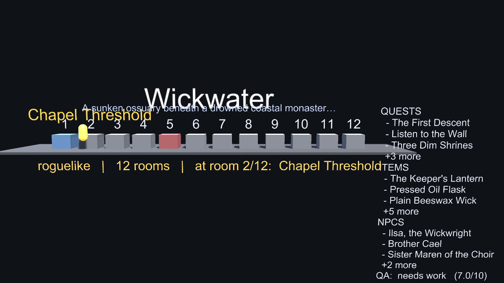

# Unity export backend

GameForge's pipeline produces an **engine-neutral** `GameProject` (Pydantic
schemas in `schemas/`). Godot is the default export target; this is a parallel
**Unity 6** backend that consumes the *same* structured data. The agent pipeline
and schemas are untouched — the Unity coupling lives entirely beside the Godot
coupling.

| Concern | Godot | Unity |
|---|---|---|
| Exporter | `orchestrator/godot_exporter.py` | `orchestrator/unity_exporter.py` |
| Template | `godot_template/` | `unity_template/` |
| Scene authoring | `.tscn` text written by Python | **C# scene-builder, built at runtime/build time** |

## Why the Unity scene is built in C#

You cannot reliably have agents (or a Python exporter) emit Unity
`.unity`/`.prefab` YAML — it's a soup of GUIDs and `.meta` references that
breaks the moment anything is regenerated. So, exactly like the **war-table**
project, the Unity scene is **constructed in C# code**, never hand-authored.

The exporter maps `GameProject` → two artifacts the C# reads:

1. `Assets/StreamingAssets/gameforge_scene.json` — a flat, `JsonUtility`-friendly
   projection of the manifest (title, genre, play spaces, quests, items, NPCs,
   QA). Python does the schema mapping; C# just renders it.
2. `Assets/GameForge/Generated/GeneratedGameInfo.cs` — the same headline data
   baked into compile-time C# constants (the "structured data → C# systems"
   seam, and a compiled fallback if the JSON is ever missing).

`Assets/GameForge/Runtime/GameForgeRuntime.cs` is the **single source of truth**:
its `Build()` constructs the whole scene in code (ground, one colour-coded room
cube per play space, a player capsule, title + info panel). It runs from **both**
Play (`Start`) and the headless Editor render, so the PNG you inspect is exactly
what plays — the same discipline war-table uses.

## Export

```bash
forge export --output ./my-unity-game --engine unity   # default engine stays godot
```

Programmatically:

```python
forge.export(Path("./my-unity-game"), engine="unity")
```

## Headless render (the verify-by-looking gate)

```powershell
$U = "A:\Unity\Hub\Editor\6000.0.77f1\Editor\Unity.exe"
$env:GF_RENDER_OUT = "$proj\_renders\slice.png"
& $U -batchmode -projectPath $proj `
     -executeMethod GameForge.Editor.HeadlessRender.RenderSlice -quit -logFile $proj\render.log
```

Note: the *first* batchmode launch on a fresh export imports + compiles and may
exit before `-executeMethod` runs; the second launch (Library warm) renders.
Look for `HEADLESS_RENDER_WROTE:` in the log. **Do not pass `-nographics`** —
`Camera.Render()` needs a graphics device.

A reference render of the Wickwater game exported to Unity:


## Standalone player build

```powershell
$env:GF_BUILD_OUT = "$proj\_build"
& $U -batchmode -projectPath $proj `
     -executeMethod GameForge.Editor.BuildPlayer.BuildStandaloneWindows -quit -logFile $proj\build.log
```

Builds a code-constructed bootstrap scene into `_build/GameForge.exe`. Look for
`GF_BUILD_RESULT result=Succeeded` in the log.

## Scope (vertical slice) & what's next

This is the **first slice**: world/regions → play spaces, a player, and one
mechanic (`NextRoom()` walks the player). The slice maps the *simplest playable*
projection of the manifest. Deferred to follow-up passes — deepening the
schema → C# mapping into real Unity systems: combat, dialogue trees, item
stats/inventory, NPC schedules, and spatial room layouts instead of a row.

## Environment

* Unity **6000.0.77f1** (Unity 6 LTS), Built-in Render Pipeline.
* `unity_template/ProjectSettings` + `Packages` are lifted from war-table's
  known-good headless-capable project config.
